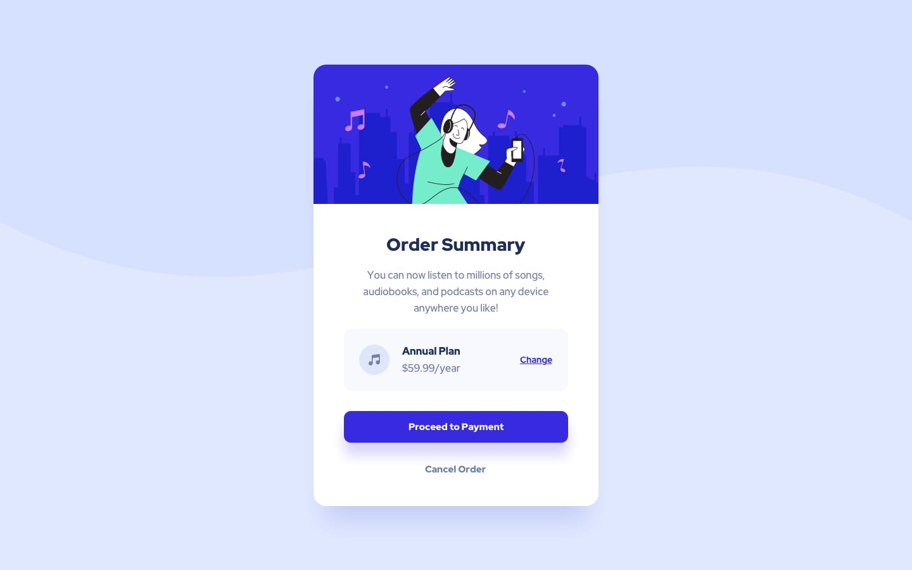

# Frontend Mentor - Order summary card solution

This is a solution to the [Order summary card challenge on Frontend Mentor](https://www.frontendmentor.io/challenges/order-summary-component-QlPmajDUj). Frontend Mentor challenges help you improve your coding skills by building realistic projects.

## Table of contents

- [Overview](#overview)
  - [The challenge](#the-challenge)
  - [Screenshot](#screenshot)
  - [Links](#links)
- [My process](#my-process)
  - [Built with](#built-with)
  - [What I learned](#what-i-learned)
- [Author](#author)

## Overview

### The challenge

Users should be able to:

- See hover states for interactive elements

### Screenshot

### Links

- Solution URL: [Source](https://github.com/steveWhoCodes/order-summary-component)
- Live Site URL: [Demo](https://stevewhocodes.github.io/order-summary-component/)

## My process

- Read any documentation
- Look at the designs in the different views
- Make sure you understand what is being asked
- Add style guid to CSS
- Build Semantic HTML framework based on visual inspection
- Start at top and work your way down with CSS matching the style guide and Figma measurements.

### Built with

- Semantic HTML5 markup
- CSS custom properties
- Flexbox
- Mobile-first workflow

### What I learned

I learned how to match the design even though the design is missing a piece. I'm able to fill in the blanks and make it work and match the design.

## Author

- Website - [Steven Palfreyman](https://www.stevewhocodes.com)
- Frontend Mentor - [steveWhoCodes](https://www.frontendmentor.io/profile/steveWhoCodes)
- Twitter - [@steveWhoCodes](https://www.twitter.com/stevewhocodes)
